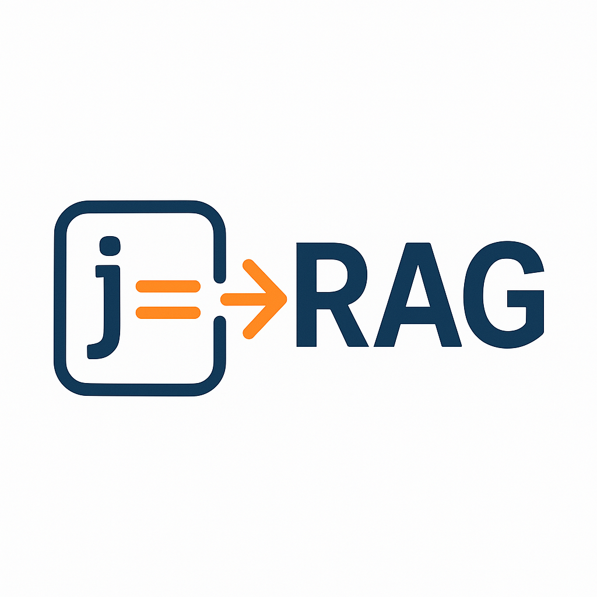

# jrag



A lightweight Python library to flatten and extract text from JSON-like data, suitable for Retrieval-Augmented Generation (RAG) pipelines.

---

## Table of Contents
- [Introduction](#introduction)
- [Features](#features)
- [Installation](#installation)
- [Quick Start](#quick-start)
- [Usage](#usage)
  - [`to_text`](#to_text)
  - [`add_text`](#add_text)
  - [`tag_list`](#tag_list)
- [Configuration Example](#configuration-example)
- [Notes and Limitations](#notes-and-limitations)
- [Contributing](#contributing)
- [License](#license)

---

## Introduction

`jrag` is a Python library that takes a dictionary or list (representing JSON data) and converts it to a text string. This is particularly useful for preparing data to be ingested by large language models in Retrieval-Augmented Generation (RAG) workflows or other text-based systems.

**Why `jrag`?**
- Simplifies JSON (or JSON-like) data into a single string.
- Preserves nested structures in a human-readable format.
- Offers optional fine-grained control using `jsonpath-ng` expressions.

---

## Features

- **Default Flattening**  
  Recursively flattens dictionaries and lists into a readable string, handling nested objects and arrays in a simple bracket/parentheses format.

- **Config-Driven Extraction**  
  Allows you to define exactly which parts of your JSON-like data to extract and how to label them, via `jsonpath-ng` expressions.

- **Easy Injection Back into Data**  
  The converted text can be inserted right back into the original dictionary, enabling a "tagging" workflow.

```python
# Example usage overview (also shown in detail below)
import jrag

data = {"name": "Example", "items": [1, {"a": True}]}
text1 = jrag.to_text(data)
# text1 -> 'name: Example | items: [1, (a: True)]'
